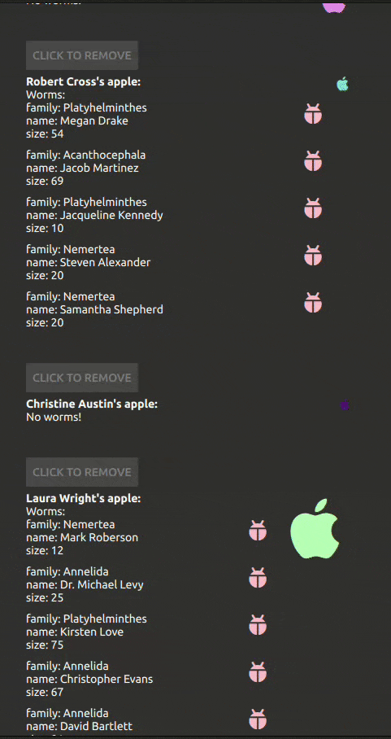

# qtier
## Cuter approach to Qt-for-python, with focus on type hints, JSON APIs and QML.

### Example Usage:
The following example shows how qtier can be used to query a graphql service.
*models.py*
```python
from qtier.itemsystem import role, define_roles


@define_roles
class Worm:
    name: str = role()
    family: str = role()
    size: int = role()


@define_roles
class Apple:
    size: int = role()
    owner: str = role()
    color: str = role()
    # nested models are also supported!
    worms: Worm = role(default=None)
```
qtier will create for you `QAbstractListModel` to be used in QML you only need to
define your models with `define_roles`.
qtier initializes the data with a dict, in this case coming from graphql service.

*main.py*
```python
import glob
import os
import sys
from pathlib import Path

from qtpy.QtQml import QQmlApplicationEngine
from qtpy.QtCore import QObject, Signal
from qtpy import QtCore, QtGui, QtQml, QtQuick

from qtier import slot
from qtier.gql.client import HandlerProto, GqlClientMessage, GqlWsTransportClient
from qtier.itemsystem import GenericModel
from tests.test_sample_ui.models import Apple


class EntryPoint(QObject):
    class AppleHandler(HandlerProto):
        message = GqlClientMessage.from_query(
            """
            query MyQuery {
              apples {
                color
                owner
                size
                worms {
                  family
                  name
                  size
                }
              }
            }
            """
        )
        def __init__(self, app: 'EntryPoint'):
            self.app = app


        def on_data(self, message: dict) -> None:
            self.app.apple_model.initialize_data(message['apples'])

        def on_error(self, message: dict) -> None:
            print(message)

        def on_completed(self, message: dict) -> None:
            print(message)

    def __init__(self, parent=None):
        super().__init__(parent)
        main_qml = Path(__file__).parent / 'qml' / 'main.qml'
        QtGui.QFontDatabase.addApplicationFont(str(main_qml.parent / 'materialdesignicons-webfont.ttf'))
        self.qml_engine = QQmlApplicationEngine()
        self.gql_client = GqlWsTransportClient(url='ws://localhost:8080/graphql')
        self.apple_query_handler = self.AppleHandler(self)
        self.gql_client.query(self.apple_query_handler)
        self.apple_model: GenericModel[Apple] = Apple.Model()
        QtQml.qmlRegisterSingletonInstance(EntryPoint, "com.props", 1, 0, "EntryPoint", self)  # type: ignore
        # for some reason the app won't initialize without this event processing here.
        QtCore.QEventLoop().processEvents(QtCore.QEventLoop.ProcessEventsFlag.AllEvents, 1000)
        self.qml_engine.load(str(main_qml.resolve()))


    @QtCore.Property(QtCore.QObject, constant=True)
    def appleModel(self) -> GenericModel[Apple]:
        return self.apple_model


def main():
    app = QtGui.QGuiApplication(sys.argv)
    ep = EntryPoint()  # noqa: F841, this collected by the gc otherwise.
    ret = app.exec()
    sys.exit(ret)


if __name__ == "__main__":
    main()
```


