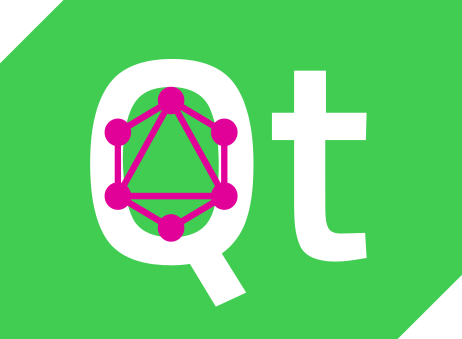

# QtGQL

{ align=center width=350}
*GraphQL client for Qt and QML.*
This library is an attempt to provide a high-level graphql client to the QT world.
## Similar projects
- [react-relay](https://relay.dev/)
- [apollo-client](https://www.apollographql.com/docs/react/)

## Features - TBD
!!! success "[Codegen (introspection compiler)](./codegen/tutorial.md)"
    - [ ] Object types, for each field there is a corresponding `Property`
    - [ ] Enums
    - [ ] Custom scalars
    - [ ] Unions
    - [ ] interfaces
    - [ ] Garbage collection
    - [x] Type-safe operation handlers
    - [ ] Query updates: fetch the same query multiple times would not instantiate everything from scratch
    - [ ] Mutations.
    - [ ] Subscriptions.
    - [ ] Fully typed input variables.

!!! success "Network layer"
    - [x] Native-Qt client implementation of "[graphql-transport-ws](https://github.com/enisdenjo/graphql-ws/blob/master/PROTOCOL.md)" protocol (supports subscriptions) - You can provide your own network layer though.


## Installation

<div class="termy">

```console

// This would install our codegen dependencies as well...

$ pip install qtgql[codegen]

---> 100%
```

</div>
