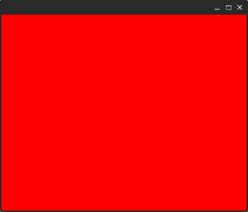

This Tutorial will walk you threw creating a Qt project using qtgql
from ground up.


This subject of this project will be a QML application that shows
countries information using a public GraphQL API that can be found [here](https://countries.trevorblades.com/)

Final code at [GitHub](https://github.com/qtgql/examples/tree/main/countries).

### Prerequisites
* Required by QtGql:
    - Python >= 3.8
    - CMake
* Required for this tutorial:
    - Conan C++ Package manager
    - [Python-Poetry](https://python-poetry.org/docs/#installation) installed we we'll use it to manage python dependencies for this tutorial
    though feel free to use any other python package manager.

### Project layout
Create a new directory named countries and setup your git/github.

We will use the "src" + CMake layout.

```bash
countries
├── 3rdparty
├── CMakeLists.txt
└── src
    ├── main.cpp
    └── qml
        └── main.qml
```

### Setup Build requirements and QtGql
Add qtgql as a submodule to 3rdparty directory.
```bash
cd 3rdparty/ && git submodule add https://github.com/qtgql/qtgql.git
cd ..
```
In order to build qtgql you'll need Qt installed.
for this tutorial we will use a conan recipe that will install Qt and set the needed variables
for cmake, see the following note.
??? Note "Install Qt"

    First  lets setup Python virtualenv using poetry.

    ```bash
    poetry init
    ```
    just hit `Enter` until it is done.

    ```bash
    poetry add conan aqtinstall
    ```
    !!! Note
        from now on every command should be prefixed with `poetry run <command>`


    Now create this conan recipe. Note that this is not a usauall recipe because
    at the moment of creating this tutorial Qt6 wasn't working well with native conan.
    `./conanfile.py`
    ```py
    from __future__ import annotations

    import contextlib
    import glob
    import logging
    import os
    import subprocess
    from functools import cached_property
    from pathlib import Path
    from typing import ClassVar
    from venv import logger

    from conan import ConanFile
    from conan.tools.cmake import CMake, CMakeDeps, CMakeToolchain, cmake_layout


    class PATHS:
        PROJECT_ROOT: ClassVar[Path] = Path(__file__).parent


    ConanBool = [True, False]


    __version__: str = "0.1.0"


    class QtGqlCountriesRecipe(ConanFile):
        settings = "os", "compiler", "build_type", "arch"
        name = "countries"
        license = "MIT"
        version = __version__
        build_policy = "missing"


        exports_sources = "CMakeLists.txt", "src/*"

        def requirements(self) -> None:
            ...

        def layout(self) -> None:
            cmake_layout(self)

        @property
        def os_name(self):
            return self.settings.os.value.lower()

        def is_windows(self) -> bool:
            return self.os_name == "windows"

        def is_linux(self) -> bool:
            return self.os_name == "linux"

        @cached_property
        def qt_version(self) -> str:
            return "6.5.0"

        @property
        def qt_arch(self) -> str:
            if self.is_linux():
                return "gcc_64"
            elif self.is_windows():
                return "win64_mingw"

        @cached_property
        def aqt_install_dir(self) -> Path:
            ret = Path.home() / "MyConnandeps" / "Qt"

            if not ret.exists():
                ret.mkdir(parents=True)
            return ret

        @property
        def qt6_install_dir(self) -> Path | None:
            relative_to = self.aqt_install_dir / self.qt_version
            if relative_to.exists():
                prev = Path.cwd()
                os.chdir(relative_to)
                res = glob.glob("**/Qt6Config.cmake", recursive=True)
                os.chdir(prev)
                with contextlib.suppress(IndexError):
                    p = (relative_to / res[0]).resolve(True)
                    return p.parent


        def generate(self) -> None:
            if not self.qt6_install_dir:
                subprocess.run(
                    f"poetry run aqt install-qt {self.os_name} "
                    f"desktop {self.qt_version} {self.qt_arch} "
                    f"--outputdir {self.aqt_install_dir} "
                    f"-m qtwebsockets".split(" "),
                ).check_returncode()
            os.environ.setdefault(
                "QT_PLUGIN_PATH",
                (self.qt6_install_dir.parent.parent.parent / "plugins").resolve(True).as_uri(),
            )
            os.environ.setdefault(
                "LD_LIBRARY_PATH",
                (self.qt6_install_dir.parent.parent.parent / "lib").resolve(True).as_uri(),
            )
            paths = os.environ.get("PATH").split(":")
            paths.append((self.qt6_install_dir.parent.parent.parent / "bin").resolve(True).as_uri())
            os.environ.setdefault("PATH", ":".join(paths))
            assert self.qt6_install_dir
            assert self.qt6_install_dir.exists()
            deps = CMakeDeps(self)
            deps.generate()
            tc = CMakeToolchain(self)
            tc.cache_variables["Qt6_DIR"] = str(self.qt6_install_dir)
            tc.generate()

        def build(self):
            cmake = CMake(self)
            cmake.configure()
            cmake.build()

        def package(self):
            cmake = CMake(self)
            cmake.install()
    ```

    Now to install Qt run:
    ```bash
    poetry run conan install .
    ```

To install the `qtgql` code-generator we need to add it as a Python dependency.
We'll use Python-Poetry:
```bash
poetry add "3rdparty/qtgql/"
```

Now lets setup CMake.
*Content of `./CMakeLists.txt`*
```cmake
cmake_minimum_required(VERSION 3.25.0)
set(CMAKE_EXPORT_COMPILE_COMMANDS ON)

project(countries VERSION 0.1.0
        LANGUAGES CXX)

set(CMAKE_CXX_STANDARD 20)
set(CMAKE_CXX_STANDARD_REQUIRED ON)
add_subdirectory(3rdparty/qtgql)


find_package(Qt6 REQUIRED COMPONENTS Core Quick)

add_executable(${PROJECT_NAME}
    "src/main.cpp"
)

target_link_libraries(${PROJECT_NAME} PRIVATE qtgql::qtgql
        Qt6::Core Qt6::Quick
        )
```

### Set up a QML window

Inside `main.cpp` past this code

```cpp
#include <QtGui>
#include <QtQuick>
#include "filesystem"

namespace fs = std::filesystem;

int main(int argc, char *argv[]){
    QGuiApplication app(argc, argv);
    QQmlApplicationEngine engine;
    QUrl url((fs::path(__FILE__).parent_path() / "qml" / "main.qml").c_str());
    engine.load(url);
    return QGuiApplication::exec();
}
```

Inside `main.qml` past this code:
```qml
import QtQuick

Window{
    width: 500;
    height: 400;
    visible: true;

    Rectangle{
        anchors.fill: parent;
        color: "red";
    }
}
```

Now lets build and run
```bash
poetry run conan build .
build/Debug/countries
```
Now you should see something like this:



### Using the [countries'](https://countries.trevorblades.com/) schema.

Create a directory for graphql, we'll call it `graphql`

Inside `graphql` create 3 files:

- `schema.graphql`  This file describes your server schema.
  (You can use the script below to fill it or copy it from [here](https://github.com/qtgql/examples/blob/main/countries/src/graphql/schema.graphql))
- `operations.graphql` - Here you would define your operations.
- `qtgqlconfig.py` - Here you would define configurations for `qtgql`

??? note "script to fetch the schema"
    ```py
    from pathlib import Path

    from graphql import build_client_schema, get_introspection_query, print_schema
    import requests

    res = requests.post("https://countries.trevorblades.com/", json={"query": get_introspection_query()})
    res.raise_for_status()
    d = res.json()['data']

    client_schema = build_client_schema(d)
    schema_file = Path(__file__).parent / "schema.graphql"
    schema_file.resolve(True).write_text(print_schema(client_schema))
    ```
by now you should have the following tree:
```bash
countries
├── 3rdparty
│   └── qtgql
│       ├── <etc>
├── build
│   └── Debug
│       ├── <etc>
├── CMakeLists.txt
├── CMakeUserPresets.json
├── conanfile.py
├── poetry.lock
├── pyproject.toml
└── src
    ├── graphql
    │   ├── operations.graphql
    │   ├── qtgqlconfig.py
    │   └── schema.graphql
    ├── main.cpp
    └── qml
        └── main.qml
```

Content of `qtgqlconfig.py`
```py
from pathlib import Path

from qtgqlcodegen.config import QtGqlConfig


config = QtGqlConfig(graphql_dir=Path(__file__).parent, env_name="Countries")
```
- `graphql_dir` - This would let qtgql know where to find your schema and operation definition.
- `env_name` - Will be used to namespace this schema at the generated code to avoid collisions
with other potential schemas.

### Writing your first query
QtGql is heavily relying on operations.
Each operation would generate it's own types that mirror concrete types that would be generated
inside `schema.hpp`

Inside `operations.graphql` create an operation that will query for all available countries:

```graphql
query ContinentQuery($code: ID!){
  continent(code:$code){
    name
    countries{
      capital
      emoji
    }
  }
}
```
Now run the codegen from `src` dir:
```bash
cd src && poetry run qtgql gen
```

Now under `src/graphql` you should have
the following:
```bash
graphql
├── __generated__
│   ├── CMakeLists.txt
│   ├── ContinentQuery.cpp
│   ├── ContinentQuery.hpp
│   └── schema.hpp
├── operations.graphql
├── qtgqlconfig.py
└── schema.graphql
```
### Use the generated code

First lets link our executable to the generated target.
Update `CMakeLists.txt`
```cmake hl_lines="21"
cmake_minimum_required(VERSION 3.25.0)
set(CMAKE_EXPORT_COMPILE_COMMANDS ON)

project(countries VERSION 0.1.0
        LANGUAGES CXX)

set(CMAKE_CXX_STANDARD 20)
set(CMAKE_CXX_STANDARD_REQUIRED ON)
add_subdirectory(3rdparty/qtgql)


find_package(Qt6 REQUIRED COMPONENTS Core Quick)

add_executable(${PROJECT_NAME}
        "src/main.cpp"
)

target_link_libraries(${PROJECT_NAME} PRIVATE
        qtgql::qtgql
        Qt6::Core Qt6::Quick
        Countries # Name of our environment
)
```
Now we'll set up the environment in C++ and fetch the first query.
**main.cpp**
```cpp
#include <QtGui>
#include <QtQuick>
#include <filesystem>
#include <memory>
#include <qtgql/bases/bases.hpp>
#include <qtgql/gqloverhttp/gqloverhttp.hpp>

#include "graphql/__generated__/ContinentQuery.hpp"


namespace fs = std::filesystem;

int main(int argc, char *argv[]){
    QGuiApplication app(argc, argv);
    QQmlApplicationEngine engine;
    // set up an environment
    auto env = std::shared_ptr<qtgql::bases::Environment>(
        new qtgql::bases::Environment("Countries",

        std::unique_ptr<qtgql::bases::NetworkLayerABC>(new qtgql::gqloverhttp::GraphQLOverHttp({"https://countries.trevorblades.com/"})))
    );
    // Export it
    qtgql::bases::Environment::set_gql_env(env);
    // Create an operation handler
    auto cont_query = Countries::continentquery::ContinentQuery::shared();
    cont_query->set_variables(Countries::continentquery::ContinentQueryVariables{.code="EU"});
    cont_query->fetch();
    engine.rootContext()->setContextProperty("query", cont_query.get());
    QUrl url((fs::path(__FILE__).parent_path() / "qml" / "main.qml").c_str());
    engine.load(url);
    return QGuiApplication::exec();
}
```
now update `main.qml` to show the data.
```qml
import QtQuick
import QtQuick.Controls
import QtQuick.Controls.Material

ApplicationWindow {id:root
    width: 500;
    height: 400;
    visible: true;
    Material.theme: Material.Dark
    Material.accent: Material.Orange
    property var continent: query?.data?.continent;

    ListView{id: countries_view
    anchors.fill: parent;
        model: root.continent?.countries;
        header:Rectangle{
            color: Material.color(Material.Indigo)
            width: ListView.view.width;
            height: 50;
            Label{
                anchors.centerIn: parent;
                text: `Countries in Continent ${root.continent?.name} (${countries_view.count}):`
            }
        }
        delegate: Rectangle{
            id: country_delegate
            required property var model;
            color: (model.index % 2 == 0)? Material.color(Material.Grey):  Material.color(Material.BlueGrey)
            property var view: ListView.view;
            width: view.width;
            height: 50;
            Label{
                anchors.left: parent.left;
                property var country: country_delegate.model.data;
                text: `${country_delegate.model.index + 1}:  ${country.emoji} capital: ${country.capital}`
            }
        }
    }
}
```
Should look like this:

